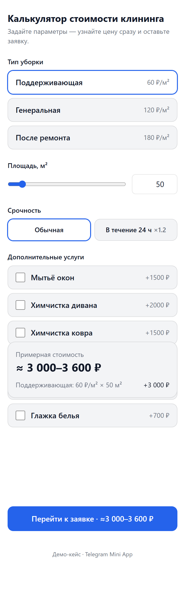
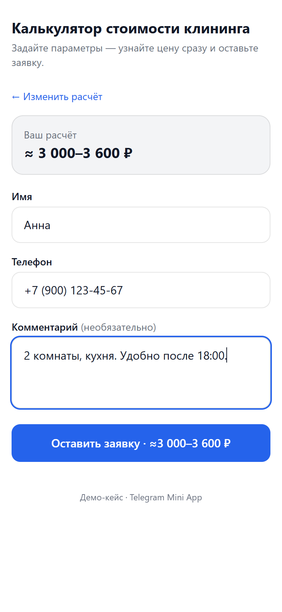
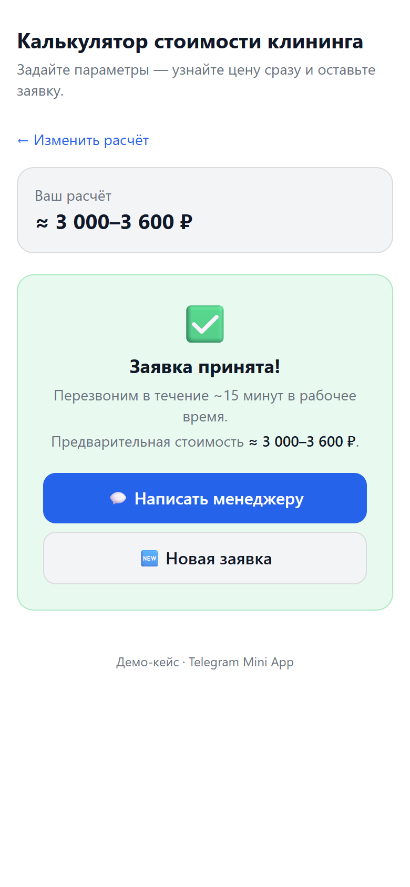

# tg-price-calc — Telegram Mini App «Калькулятор стоимости клининга + заявка»

**🔗 Живое демо:** https://tg-price-calc.vercel.app — открывается в обычном браузере
и как Telegram Mini App.

Демо-кейс для портфолио. Клиент задаёт параметры уборки → видит вилку цены вживую →
оставляет заявку → владельцу приходит уведомление в Telegram с готовым расчётом.

Архитектура не привязана к нише: смена ниши = правка `src/config/pricing.config.ts`
и текстов. Код калькулятора и отправки заявки не меняется.

## Скриншоты
| Калькулятор (живой расчёт) | Форма заявки | Заявка принята |
|:--:|:--:|:--:|
|  |  |  |

## Стек
- Next.js 14 (App Router) + TypeScript
- Tailwind CSS
- Zod — валидация заявки на бэке
- Telegram WebApp SDK (тема, MainButton, initData)
- Telegram Bot API — уведомление владельцу
- Хостинг: Vercel (страница + serverless API route)
- БЕЗ базы данных, оплаты и авторизации

## Локальный запуск
```bash
npm install
npm run dev      # http://localhost:3000
```
Windows PowerShell: если `npm.ps1` блокируется политикой — используйте `npm.cmd run dev`.

Демо работает **в обычном браузере** (обычная кнопка отправки) и **внутри Telegram**
(нижняя MainButton). Без токенов всё считает и «отправляет» заявку в mock-режиме.

## Как это считает
`total = ставка[тип] × площадь × коэф_срочности + сумма доп-опций`, затем применяется
минимальный заказ (если `total < minOrder` → `minOrder`). Вилка цены:
`min = round(total)`, `max = round(total × 1.2)`.

Прайс целиком лежит в `src/config/pricing.config.ts`:
| Параметр | Значение |
|---|---|
| Поддерживающая | 60 ₽/м² |
| Генеральная | 120 ₽/м² |
| После ремонта | 180 ₽/м² |
| Минимальный заказ | 2500 ₽ |
| Срочность | обычная ×1.0 · 24 ч ×1.2 |
| Доп-опции | окна 1500 · диван 2000 · ковёр 1500 · духовка 800 · холодильник 600 · глажка 700 |

Чистая функция расчёта — `src/lib/pricing.ts: calculatePrice(config, input)`.

## API: `POST /api/lead`
Тело (JSON):
```json
{
  "name": "Иван",
  "phone": "+7 900 000-00-00",
  "comment": "необязательно",
  "calc": { "type": "general", "area": 50, "urgency": "normal", "options": ["windows"], "min": 6000, "max": 7200 }
}
```
- Валидация через Zod. Невалидные данные → `400` с ошибками.
- Если заданы `TELEGRAM_BOT_TOKEN` и `TELEGRAM_CHAT_ID` → реальная отправка владельцу.
- Если нет → mock: payload в консоль сервера, ответ `{ ok: true, mock: true }`.
- При валидном вводе в демо роут никогда не падает.

## Подключение бота (реальные уведомления)
1. Создайте бота у [@BotFather](https://t.me/BotFather) → получите **token**.
2. Узнайте свой **chat_id** (напишите боту, затем [@getmyid_bot](https://t.me/getmyid_bot) или [@userinfobot](https://t.me/userinfobot)).
3. Скопируйте `.env.example` → `.env.local` и заполните:
   ```
   TELEGRAM_BOT_TOKEN=123456:ABC...
   TELEGRAM_CHAT_ID=123456789
   ```
4. Перезапустите `npm run dev`. Теперь заявки приходят в Telegram.

### Привязать Mini App к боту
1. У @BotFather: `/newapp` (или Bot Settings → Menu Button / Web App) → укажите URL
   задеплоенного приложения (см. ниже).
2. Откройте бота → кнопка меню/`web_app` запустит Mini App внутри Telegram.

## Деплой на Vercel (авто-деплой из GitHub)
1. Залейте репозиторий на GitHub.
2. На [vercel.com](https://vercel.com) → **New Project** → импортируйте репозиторий
   (или свяжите существующий проект: `vercel git connect <repo-url>`).
3. Framework определится как Next.js автоматически. **Environment Variables**:
   `TELEGRAM_BOT_TOKEN`, `TELEGRAM_CHAT_ID`, `TELEGRAM_WEBHOOK_SECRET`,
   `NEXT_PUBLIC_APP_URL` (для реальных уведомлений и webhook).
4. **Deploy**. Дальше каждый `git push` в `main` → автоматический прод-деплой;
   пуши в другие ветки → preview-деплои.
5. Прод-URL укажите в @BotFather как Web App URL и в `setWebhook`.

## Структура
```
src/
  app/
    layout.tsx                   # telegram-web-app.js, мета/OG
    page.tsx                     # экран: калькулятор + форма; BackButton
    globals.css
    api/lead/route.ts            # POST /api/lead: Zod + серверный пересчёт + отправка/мок
    api/telegram/webhook/route.ts# Telegram webhook: статусы заявок + /start
  components/
    Calculator.tsx               # UI калькулятора, живой расчёт
    LeadForm.tsx                 # форма: маска телефона, success-экран, MainButton
  lib/
    pricing.ts                   # чистая функция расчёта
    pricing.test.ts              # юнит-тесты (vitest)
    schema.ts                    # Zod-схема (строгие enum по конфигу)
    telegram.ts                  # сборка сообщения + sendMessage + кнопки статуса
    telegram-initdata.ts         # HMAC-проверка подписи Telegram initData
    useTelegram.ts               # хук инициализации WebApp + тема
    telegram-webapp.d.ts         # типы SDK
  config/
    pricing.config.ts            # ПРАЙС НИШИ + контакты (точка смены ниши)
public/
  screenshots/                   # скриншоты для портфолио
```

## Кто что видит: клиент vs владелец
- **Клиент** (любой пользователь бота) видит ОДИН и тот же интерфейс: калькулятор
  + форму заявки. Чужих/своих заявок он не видит — это просто веб-страница.
- **Владелец** (chat_id из env) получает заявки в личку с расчётом и кнопками
  статуса «🟡 В работе / ✅ Обработано». Статус хранится прямо в сообщении.
- **Превью «как у клиента»:** просто откройте `NEXT_PUBLIC_APP_URL` в браузере или
  запустите Mini App из другого Telegram-аккаунта — вид идентичен.

## Отслеживание заявок у владельца (webhook)
Под каждой заявкой — inline-кнопки статуса. Чтобы они работали, бот должен
получать апдейты на `/api/telegram/webhook`:
```bash
# 1) задайте секрет в env (Vercel + .env.local): TELEGRAM_WEBHOOK_SECRET=...
# 2) зарегистрируйте webhook (один раз):
curl "https://api.telegram.org/bot<TOKEN>/setWebhook" \
  -d "url=https://<домен>/api/telegram/webhook" \
  -d "secret_token=<TELEGRAM_WEBHOOK_SECRET>"
```
`/start` боту отвечает приветствием и кнопкой запуска Mini App (онбординг).

## Допущения (демо)
- Без токенов приложение работает в **mock-режиме** — штатное поведение демо.
- Цена пересчитывается на сервере по конфигу; клиентским `min/max` не доверяем.
- Подпись `initData` проверяется (HMAC по токену бота); при отсутствии токена —
  пропускается (mock).
- Нет БД: заявки не хранятся. Повторная (исправленная) заявка определяется в
  пределах одной сессии (счётчик отправок), межсессионный дедуп — апсейл.
- Статусы заявок живут в тексте/кнопках Telegram-сообщения (без БД).
- Вилка цены (`×1.2`) — демонстрационная «вверх», точную смету подтверждает менеджер.
- Контакт менеджера в `pricing.config.ts` — плейсхолдер, заменить на реальный.

## TODO после goal
- Запись заявок в Google Sheets через `GOOGLE_APPS_SCRIPT_WEBHOOK_URL` (апсейл).
- Антиспам/rate-limit на `/api/lead`.
- Межсессионный дедуп повторных заявок (требует хранилища).

## Безопасность
Секреты (`TELEGRAM_BOT_TOKEN`, `TELEGRAM_CHAT_ID`, `TELEGRAM_WEBHOOK_SECRET`)
хранятся только в `.env.local` (в `.gitignore`) и в переменных окружения Vercel —
в репозитории их нет. `.env.example` содержит лишь пустые ключи.

## Лицензия
[MIT](LICENSE)
